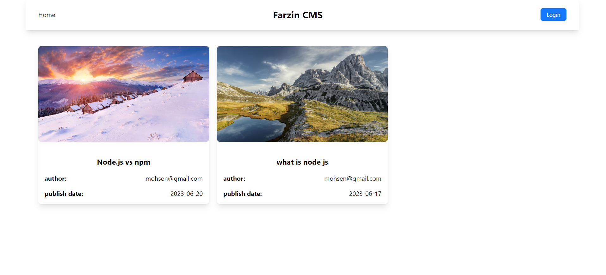
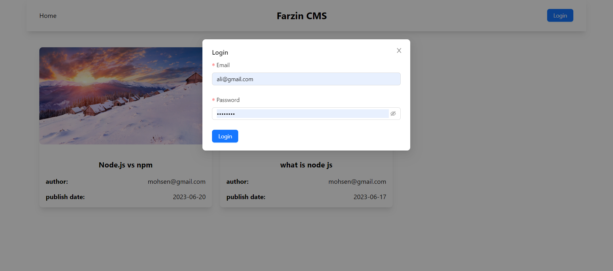
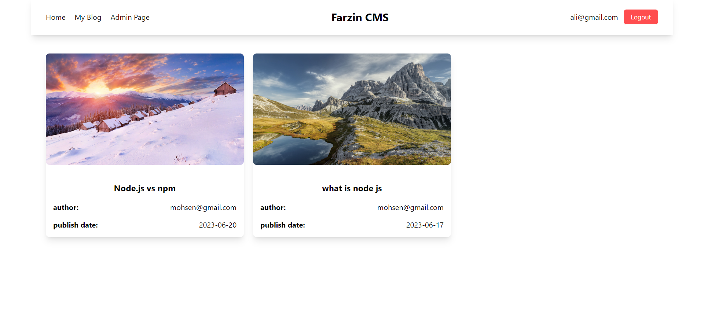
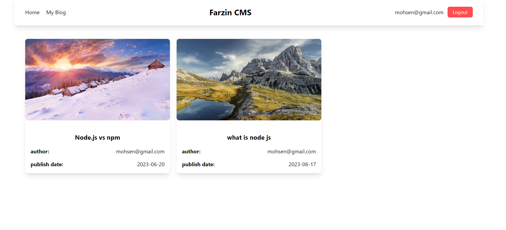
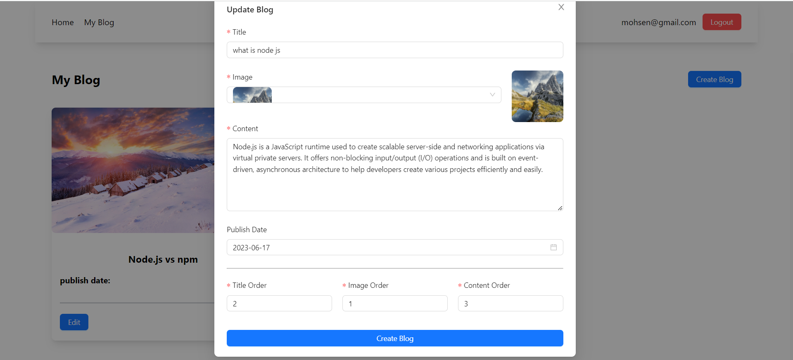
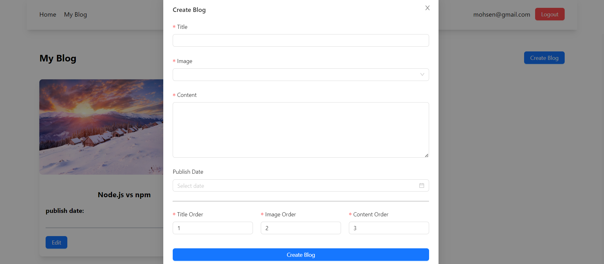
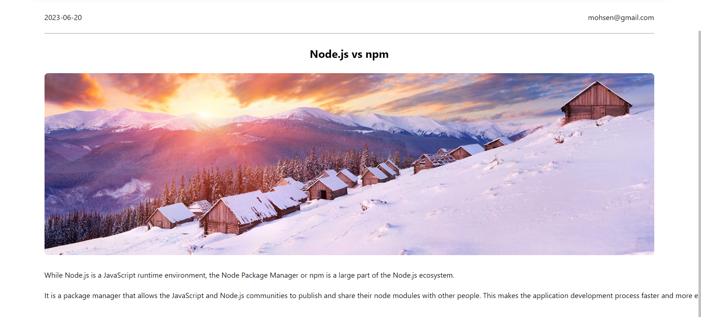
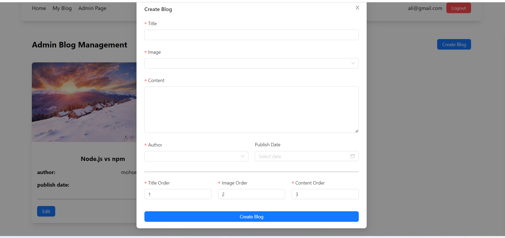

# Farzin CMS
# Exam 1: #CMSmall"
## Student: s314589 FARZIN SETAYESH

# Server-side
an express.js application
## Run Server Project

1. `cd server`
2. `npm install`
3. `nodemon index.js`

## List of APIs offered by the server


Provide a short description for API with the required parameters, and follow the proposed structure.

* [HTTP Method] [URL, with any parameter]
* [One-line about what this API is doing]
* [Sample request, with body (if any)]
* [Sample response, with body (if any)]
* [Error responses, if any]

### 1. Authentication
#### Login

* HTTP method: `POST`  URL: `/api/sessions`
* Description: authenticate the user who is trying to login
* Request body: credentials of the user who is trying to login

``` JSON
{
    "email": "ali@gmail.com",
    "password": "testtest"
}
```

* Response: `201 OK` (success)
* Response body: authenticated user

``` JSON
{
    "id": 1,
    "email": "ali@gmail.com",
    "role": "admin"
}
```

* Error responses:  `500 Internal Server Error` (generic error), `401 Unauthorized User` (login failed)

#### Check if a user is logged in

* HTTP method: `GET`  URL: `/api/sessions/current`
* Description: check if the current user is logged in and get her data
* Request body: _None_
* Response: `200 OK` (success)

* Response body: authenticated user

``` JSON
{
    "id": 1,
    "email": "ali@gmail.com",
    "role": "admin"
}
```

* Error responses: `500 Internal Server Error` (generic error), `401 Unauthorized User` (user is not logged in or logged out before)

#### Logout

* HTTP method: `DELETE`  URL: `/api/sessions/current`
* Description: logout current user
* Request body: _None_
* Response: `200 OK` (success)

* Response body: _None_

* Error responses: `500 Internal Server Error` (generic error), `401 Unauthorized User` (user is not logged in)

### 2. Pages `for all without authentication`
Index page
* HTTP method: `GET`  URL: `/api/pages`
* Description: Get the full list of pages that are published
* Request body: _None_
* Response: `200 OK` (success)
* Response body: Array of objects, each describing one page:

``` JSON
{
    "status": true,
    "data": [
        {
            "title": "Node.js vs npm",
            "image": "http://localhost:3000/images/img-2.jpg",
            "publishedAt": "2023-06-20",
            "pageId": 33,
            "createdAt": "2023-06-24 19:35:25",
            "authorId": 2,
            "authorEmail": "mohsen@gmail.com"
        },
        ....
    ]
}
```

* Error responses:  `500 Internal Server Error`
  
Get a page by id
* HTTP method: `GET`  URL: `/api/pages/:id`
* Description: Get the page corresponding to the id
* Request body: _None_
* Response: `200 OK` (success)
* Response body: Array of objects, each describing one page:

``` JSON
{
    "status": true,
    "data": {
        "id": 33,
        "title": "Node.js vs npm",
        "content": "While Node.js is a JavaScript runtime environment, the Node Package Manager or npm is a large part of the Node.js ecosystem.\n\nIt is a package manager that allows the JavaScript and Node.js communities to publish and share their node modules with other people. This makes the application development process faster and more efficient.",
        "createdAt": "2023-06-24 19:35:25",
        "publishedAt": "2023-06-20",
        "author": 2,
        "image": "http://localhost:3000/images/img-2.jpg",
        "orders": "{\"orderContent\":3,\"orderTitle\":1,\"orderImage\":2}",
        "authorEmail": "mohsen@gmail.com"
    }
}
```

* Error responses:  `500 Internal Server Error`, `404 page not found`

### 3. Pages `for authenticated users`
Create a page
* HTTP method: `POST`  URL: `/api/pages`
* Description: Add a page to the pages of the logged in user
* Request body: credentials of the user who is trying to create a page

``` JSON
{
    "title": "node 27",
    "publishedAt": "2023-06-19",
    "content": "While Node.js is a JavaScript runtime environment, the Node Package Manager or npm is a large part of the Node.js ecosystem.\n\nIt is a package manager that allows the JavaScript and Node.js communities to publish and share their node modules with other people. This makes the application development process faster and more efficient.",
    "image": "http://localhost:3000/images/img-2.jpg",
    "orders": "{\"orderContent\":3,\"orderTitle\":1,\"orderImage\":2}"
}
```

* Response: `200 OK` (success)
* Response body: created page

``` JSON
{
    "status": true,
    "data": 34
}
```

* Error responses:  `500 Internal Server Error`, `401 Unauthorized User`
  
Update an existing page
* HTTP method: `PATCH`  URL: `/api/pages/:id`
* Description: Update the page corresponding to the id
* Request body: 

``` JSON
{
    "title": "node 29",
    "publishedAt": "2023-06-19",
    "content": "While Node.js is a JavaScript runtime environment, the Node Package Manager or npm is a large part of the Node.js ecosystem.\n\nIt is a package manager that allows the JavaScript and Node.js communities to publish and share their node modules with other people. This makes the application development process faster and more efficient.",
    "image": "http://localhost:3000/images/img-2.jpg",
    "orders": "{\"orderContent\":3,\"orderTitle\":1,\"orderImage\":2}"
}
```

* Response: `200 OK` (success)
* Response body: 
``` JSON
{
    "status": true
}
```
* Error responses:  `500 Internal Server Error`, `401 Unauthorized User`
  
Delete an existing page
* HTTP method: `DELETE`  URL: `/api/pages/:id`
* Description: delete the page corresponding to the id
* Request body:

``` JSON
{
    "title": "node 29",
    "publishedAt": "2023-06-29",
    "content": "While Node.js is a JavaScript runtime environment, the Node Package Manager or npm is a large part of the Node.js ecosystem.\n\nIt is a package manager that allows the JavaScript and Node.js communities to publish and share their node modules with other people.",
    "image": "http://localhost:3000/images/img-3.jpg",
    "orders": "{\"orderContent\":3,\"orderTitle\":2,\"orderImage\":1}"
}
```

* Response: `200 OK` (success)
* Response body: 
``` JSON
{
    "status": true
}
```
* Error responses:  `500 Internal Server Error`, `401 Unauthorized User` 


### 4. Page management
Create a page
* HTTP method: `POST`  URL: `/api/pages/by-admin`
* Description: Add a page to the pages of the user
* Request body: credentials of the user who is trying to create a page

``` JSON
{
    "title": "test",
    "author": 2,
    "publishedAt": "2023-06-19",
    "content": "long text",
    "image": "http://localhost:3000/images/img-2.jpg",
    "orders": "{\"orderContent\":3,\"orderTitle\":1,\"orderImage\":2}"
}
```

* Response: `200 OK` (success)
* Response body: created page

``` JSON
{
    "status": true,
    "data": 34
}
```

* Error responses:  `500 Internal Server Error`, `401 Unauthorized User` ,`401 permission deny`,`422 Unprocessable Entity`
  
Update a page
* HTTP method: `PATCH`  URL: `/api/pages/by-admin/:id`
* Description: update a page corresponding to the id
* Request body:

``` JSON
{
    "title": "node #6",
    "publishedAt": "2023-06-30",
    "content": "text",
    "author": 2,
    "image": "http://loclhost:3001/img2.png",
    "orders": "{\"orderContent\":3,\"orderTitle\":1,\"orderImage\":2}"
}
```

* Response: `200 OK` (success)
* Response body: updated page

``` JSON
{
    "status": true,
}
```

* Error responses:  `500 Internal Server Error`, `401 Unauthorized User` ,`401 permission deny`,`422 Unprocessable Entity`
  
Delete a page
* HTTP method: `DELETE`  URL: `/api/pages/by-admin/:id`
* Description: Delete a page corresponding to the id
* Request body: _None_

* Response: `200 OK` (success)
* Response body: 

``` JSON
{
    "status": true,
}
```

* Error responses:  `500 Internal Server Error`, `401 Unauthorized User` ,`401 permission deny`

### 5. Pages `for authenticated users and admins`
my blog
* HTTP method: `GET`  URL: `/api/pages/my-blog`
* Description: Get the full list of pages owned by the user
* Request body: _None_
* Response: `200 OK` (success)
* Response body: Array of objects, each describing one page:

``` JSON
{
    "status": true,
    "data": [
        {
            "id": 36,
            "title": "node 27",
            "content": "long text",
            "createdAt": "2023-06-25 13:30:27",
            "publishedAt": "2023-06-19",
            "author": 1,
            "image": "http://loclhost:3001/img.png",
            "orders": "{\"orderContent\":3,\"orderTitle\":1,\"orderImage\":2}"
        },
        ....
    ]
}
```

* Error responses:  `500 Internal Server Error` , `401 Unauthorized User`

### 6. Users `for admins`
* HTTP method: `GET`  URL: `/api/user`
* Description: Get the full list of users
* Request body: _None_
* Response: `200 OK` (success)
* Response body: Array of objects, each describing a user:

``` JSON
{
    "status": true,
    "data": [
        {
            "email": "ali@gmail.com",
            "id": 1
        },
        {
            "email": "mohsen@gmail.com",
            "id": 2
        },
        {
            "email": "nazanin@gmail.com",
            "id": 3
        },
        {
            "email": "satoshi@gmail.com",
            "id": 4
        }
    ]
}
```

* Error responses:  `500 Internal Server Error` , `401 Unauthorized User`,`401 Permission Deny`

## Database Tables

- Table `user` - contains id,email,role,password,salt
- Table `pages` - contains id,title,createdAt,publishedAt,author,image,orders,content

## Run Client Project

1. `npm i`
2. `npm start`

## Client Project Tools

1. Redux-toolkit (Global state management)
2. React-Query (Api Base Calls)
3. Antd Design (UI components)
4. Tailwind (CSS Framework)
5. React Router (Route Management)

## Client Project Routes

1. Route `/` : All Blogs that shows to login user or anonymous user
2. Route `/my-blog` : All own blogs that is login to site.
3. Route `/admin` : Manage All Blog by admin role.
4. Route `/single-blog/:blogId` : Show single blog.

## Client Main Folders

1. core folder : contains utils and helpers and reusable hooks and types.
2. components : contains all components that we use in the project
3. page : contains all routes that have a page in the client
4. assets : contain css file

## Client Main Components

1. `MainRoute.tsx` : Manage project route system and contains private route that depends on user roles
2. `Header.tsx` : Project Navbar
3. `MainLayout.tsx` : Project Main layout that is the same for all routes
4. `MainPage.tsx` : Content of Route `/`
5. `AdminPage.tsx` : Content of Route `/admin`
6. `MyBlogPage.tsx` : Content of Route `/my-blog`
7. `SingleBlogPage.tsx` : Content of Route `/single-blog/:blogId`

## Users Credentials
Here you can find a list of the users already registered inside the provided database.

| email            |  password     | role |
|------------------|---------------|------|
| ali@gmail.com    | testtest      | admin|
| mohsen@gmail.com | testtest      | user |
| nazanin@gmail.com| testtest      | user |
| satoshi@gmail.com| testtest      | user |

## Screenshots

### login
this is a farzin cms website at the top of the screen on the right side we can log in to the user account


and then you can enter your email and password, the admin and other users can see the blog 


you  can see that I log in to my admin page and on the website we have an admin page to edit and delete posts and also change authors for blogs


and then at the top of the website at the right, you can log out from the website


this is the part when someone that is not the admin can edit the blog or delete it except the author part


and this is the part when someone that is not an admin can create a new blog


this is one of my blogs


and this is an admin part that can create a blog or edit or deleting, in this part we can also change the author of the blog

